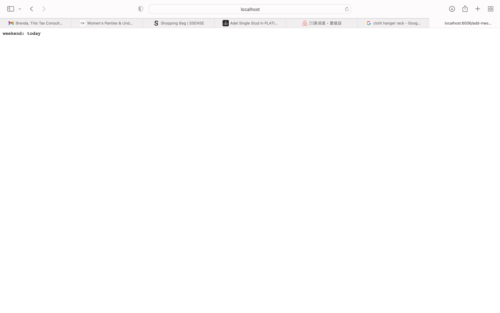

**Part1**
```
import java.io.IOException;
import java.net.URI;
class Handler implements URLHandler {
    // The one bit of state on the server: a number that will be manipulated byhttp://localhost:4000
    // various requests.
    public int size = 10;
    private static final int expand = 2; 
    public int num = 0;
    public String[] information = new String[size];

    public String handleRequest(URI url) {
         if (url.getPath().contains("/add-message")) {
            String[] messages = url.getQuery().split("&");
            String[] param1 = messages[0].split("=");
            String[] param2 = messages[1].split("=");
            if(size == information.length){
                int newsize = size * expand; 
                String[] newinform = new String[newsize];
                for(int i = 0; i < size; i++) {
                    newinform[i] = information[i];
                }
                information = newinform;
                size = newsize; 
            }
            if (param1[0].contains("s")&&param2[0].contains("user")) {
                String message = param2[1] + ": " + param1[1];
                information[num] = message;
                num += 1; 
                String returnmsg = "";
                for(int i = 0; i < num; i++){
                    if(information[i] != null){
                        returnmsg += information[i] + "\n";
                    }

        
                }
                return returnmsg;

            }
            
            return "right path but wrong query";
            
    
        }
    
        return "404 Not Found!";
        
    }
}

class ChatServer {
    public static void main(String[] args) throws IOException {
        if(args.length == 0){
            System.out.println("Missing port number! Try any number between 1024 to 49151");
            return;
        }

        int port = Integer.parseInt(args[0]);

        Server.start(port, new Handler());
    }
}
```
*Output1*
<br>
When I input an `url`, method `handleRequest` is called. <br>
Argument is `http://localhost:6006/add-message?s=today&user=weekend` as `url`. Since the `url` contains `/add-message`, the `url` is splited into three string array as `messages`, `param1` and `param2`. `if` statement applies to a size check to make sure the `information` has enought size. Since the size is enought, `param1[1]` as `today` and `param2[1]` as `weekend` and `: ` is stored into `information[num]` as a whole string. `num` is updated afterwards. <br>
After the method run, `information` becomes `['weekend: today']`. `num` is updated to 1. <br>

*Output2*
<br>
When I input an `url`, method `handleRequest` is called. 
Argument is `http://localhost:6006/add-message?s=hello&user=Brenda` as `usl`. Sincer the `url` contains `/add-message`, the `url` is splited into three string array as `meesages`, `param1` and `param2`. `if` statement is used to make sure the `information` has enough space to store the new message. Since the size enough in this method call, `param1[1]` as `hello` and `param2[1]` as `Brenda` and `: ` instored into `information[num]` as a whole string. `num` is updated afterwards. <br>
After the method run, `information` becomes `['weeked: today' /n 'Brenda: hello']`<br>

**Part2**
1.Private key <br>
 <br>

2.Public key <br>
 <br>

3.Terminal <br>
<br>

  


