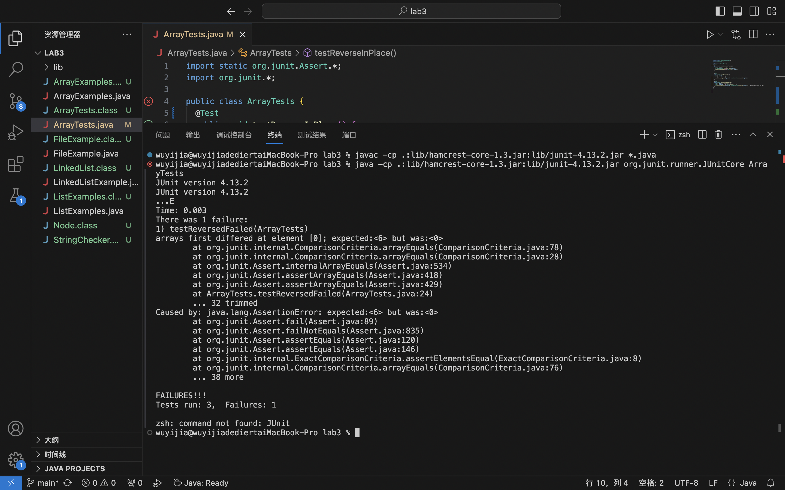

# Part1: Bugs
**1. Failed test** <br>
the input is `int[] input1 = {1,2,3,4,5,6}`, and the test would faile with this input. <br>
```
@Test 
  public void testReversedFailed(){
    int[] input1 = {1,2,3,4,5,6};
    int[] expected = new int[]{6,5,4,3,2,1};
    assertArrayEquals(expected, ArrayExamples.reversed(input1));
  }
```
**2. Passed test which didn't find the code bug** <br>
the input is `int[] input1 = { }`. The test would show pass because the array is an empty array which would test out the bug of the original code. <br>
```
@Test
  public void testReversed() {
    int[] input1 = { };
    int[] expected = {};
    assertArrayEquals(expected, ArrayExamples.reversed(input1));
  }
```
**3. Symptom** <br>
For the test with input of empty array, the test shows it passed. However for the test with elements in the array, the message shows the outcome is different with the expected output. The expected output for the element at index 0 is 6 but the outcome is 0. Therefore we know that the code didn't reserve the array in a correct order. <br>
 <br>

**4. Fixed Bugs** <br>
*Before*: <br>
```
static int[] reversed(int[] arr) {
    int[] newArray = new int[arr.length];
    for(int i = 0; i < arr.length; i += 1) {
      arr[i] = newArray[arr.length - i - 1];
    }
    return arr;
  }
```
Originally, we create the `newArray` aiming to pass the element in `arr` in a reserve order. However, the for loop assign `arr[i]`'s element with `newArray[arr.length - i - 1]`. Since we create the `newArray` with 0 as it's element, the array `arr` would be all 0 as its element after the for loop. Therefore, we didn't succesfully reserve the array. <br>

*After*: <br>
```
static int[] reversed(int[] arr) {
    int[] newArray = new int[arr.length];
    for(int i = 0; i < arr.length; i += 1) {
      newArray[i] = arr[arr.length - i - 1];
    }
    return newArray;
  }
```
The above code fixed the bug. I switch the position of `newArray` with `arr` in the for loop. I put `newArray` in the left, and `arr` in the right. Now, the for loop would assign the element in `arr` into `newArray` in a reverse order correctly. <br>

# Part 2: Researching commands <br>
**1. `-size`**
```
wuyijia@wuyijiadediertaiMacBook-Pro docsearch % find ./technical -size -1M | head -n 10
./technical
./technical/government
./technical/government/About_LSC
./technical/government/About_LSC/LegalServCorp_v_VelazquezSyllabus.txt
./technical/government/About_LSC/Progress_report.txt
./technical/government/About_LSC/Strategic_report.txt
./technical/government/About_LSC/Comments_on_semiannual.txt
./technical/government/About_LSC/Special_report_to_congress.txt
./technical/government/About_LSC/CONFIG_STANDARDS.txt
./technical/government/About_LSC/commission_report.txt
```
The command `-size` allows the `find` to search based on the size of the files in the directory. For this example, I put `-1M` as the requirement, then it would show up all the files whose size is under 1M in the directory `./technical`. Since there are too many files under 1M, I add `|head -n 10` command to ask the terminal only show the first 10 files of the outcome. <br>

```
wuyijia@wuyijiadediertaiMacBook-Pro docsearch % find ./technical -size +200k | head -n 10
./technical/government/About_LSC/commission_report.txt
./technical/government/Env_Prot_Agen/bill.txt
./technical/government/Gen_Account_Office/GovernmentAuditingStandards_yb2002ed.txt
./technical/government/Gen_Account_Office/Statements_Feb28-1997_volume.txt
./technical/government/Gen_Account_Office/d01591sp.txt
./technical/911report/chapter-13.4.txt
./technical/911report/chapter-13.5.txt
./technical/911report/chapter-3.txt
```
The command `-size` allows the `find` to search based on the size of the files in the directory. For this example, I put `+200k` as the requirement, then it would show up all the files whose size is larger than 200k in the directory `./technical`. Since there are too many files under 1M, I add `|head -n 10` command to ask the terminal only show the first 10 files of the outcome. <br>

**2. `-maxdepth`**
```
wuyijia@wuyijiadediertaiMacBook-Pro docsearch % find ./technical -maxdepth 1
./technical
./technical/government
./technical/plos
./technical/biomed
./technical/911report
```
The command `-maxdepth` specifies the maximum directories the `find` command can search for files or directories. I pass `1` after `-maxdepth` restricts the `find` command only can find maximum 1 depth of the directory in `./technical`. <br>
```
wuyijia@wuyijiadediertaiMacBook-Pro docsearch % find ./technical -maxdepth 0
./technical
```
The command `-maxdepth` specifies the maximum directories the `find` command can search for files or directories. For this example, I pass `0` after the command `find`, so this command can only search for directories with maximum of 0 depth in './technical'. <br>

**3. `-type`**
```
wuyijia@wuyijiadediertaiMacBook-Pro docsearch % find ./technical -type d  
./technical
./technical/government
./technical/government/About_LSC
./technical/government/Env_Prot_Agen
./technical/government/Alcohol_Problems
./technical/government/Gen_Account_Office
./technical/government/Post_Rate_Comm
./technical/government/Media
./technical/plos
./technical/biomed
./technical/911report
```
The command `type` is used to specify the files or directories we want to search. For this example, I pass `d` after the command to specify that I only want to search for directory in the `./technical`. <br>

```
wuyijia@wuyijiadediertaiMacBook-Pro docsearch % find ./technical -type f | head -n 10
./technical/government/About_LSC/LegalServCorp_v_VelazquezSyllabus.txt
./technical/government/About_LSC/Progress_report.txt
./technical/government/About_LSC/Strategic_report.txt
./technical/government/About_LSC/Comments_on_semiannual.txt
./technical/government/About_LSC/Special_report_to_congress.txt
./technical/government/About_LSC/CONFIG_STANDARDS.txt
./technical/government/About_LSC/commission_report.txt
./technical/government/About_LSC/LegalServCorp_v_VelazquezDissent.txt
./technical/government/About_LSC/ONTARIO_LEGAL_AID_SERIES.txt
./technical/government/About_LSC/LegalServCorp_v_VelazquezOpinion.txt
```
The command `type` is used to specify the files or directories we want to search. For this example, I pass `f` after the command to specify that I only want to search for regualr files in the directory `./technical`. <br>

**4. `-iregex`**
```
wuyijia@wuyijiadediertaiMacBook-Pro docsearch % find ./technical -iregex ".*\.txt" | head -n 10
./technical/government/About_LSC/LegalServCorp_v_VelazquezSyllabus.txt
./technical/government/About_LSC/Progress_report.txt
./technical/government/About_LSC/Strategic_report.txt
./technical/government/About_LSC/Comments_on_semiannual.txt
./technical/government/About_LSC/Special_report_to_congress.txt
./technical/government/About_LSC/CONFIG_STANDARDS.txt
./technical/government/About_LSC/commission_report.txt
./technical/government/About_LSC/LegalServCorp_v_VelazquezDissent.txt
./technical/government/About_LSC/ONTARIO_LEGAL_AID_SERIES.txt
./technical/government/About_LSC/LegalServCorp_v_VelazquezOpinion.txt
```
The command `-iregex` specifies the `find` command to search for files or directories follows the certain pattern. I pass `".*\.txt"` asks the computer to search for files and directories in `./technical` directory which is text file. Since there are too many text file in the directory `./technical`, I added `head -n 10` to ask the terminal only show the first 10 text files in the directory. <br>
```
wuyijia@wuyijiadediertaiMacBook-Pro docsearch % find ./technical -iregex ".*chapter.*"
./technical/911report/chapter-13.4.txt
./technical/911report/chapter-13.5.txt
./technical/911report/chapter-13.1.txt
./technical/911report/chapter-13.2.txt
./technical/911report/chapter-13.3.txt
./technical/911report/chapter-3.txt
./technical/911report/chapter-2.txt
./technical/911report/chapter-1.txt
./technical/911report/chapter-5.txt
./technical/911report/chapter-6.txt
./technical/911report/chapter-7.txt
./technical/911report/chapter-9.txt
./technical/911report/chapter-8.txt
./technical/911report/chapter-12.txt
./technical/911report/chapter-10.txt
./technical/911report/chapter-11.txt
```
The command `-iregex` specifies the `find` command to search for files or directories follows the certain pattern. I pass `".*chapter.*"` which asks the computer to search for files or directories in `./technical` with `chatper` in any position. <br>

**Citation** <br>
Prompt for Chatgpt: <br>
1. Commands that can use with `find` in the terminal
   *Chatgpt give me several commands that can use with `find` and it offers me some brief explanation of the function for each command. I pick four from the list of commands which I think I understand how to use it with it's explanation.* <br>
2. How to use `-iregex` with `find`
   *For this specific command, I didn't really understand how should I pass in the argument after the `-iregex`, so I asked Chatgpt to give me more specific information. Chatgpt gives me some examples of useing `-iregex`, then I followed the instruction to apply the command in the direcotry `./technical`.*


