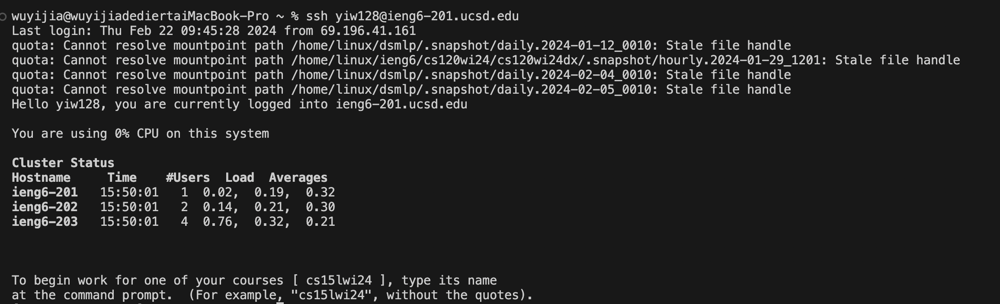
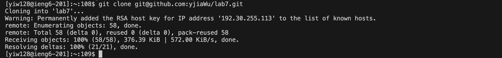
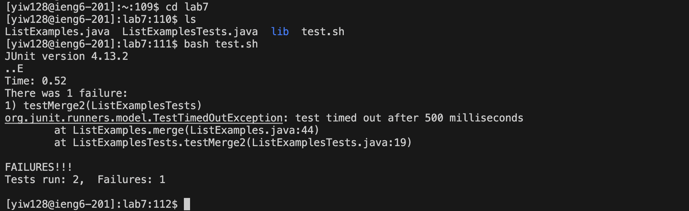
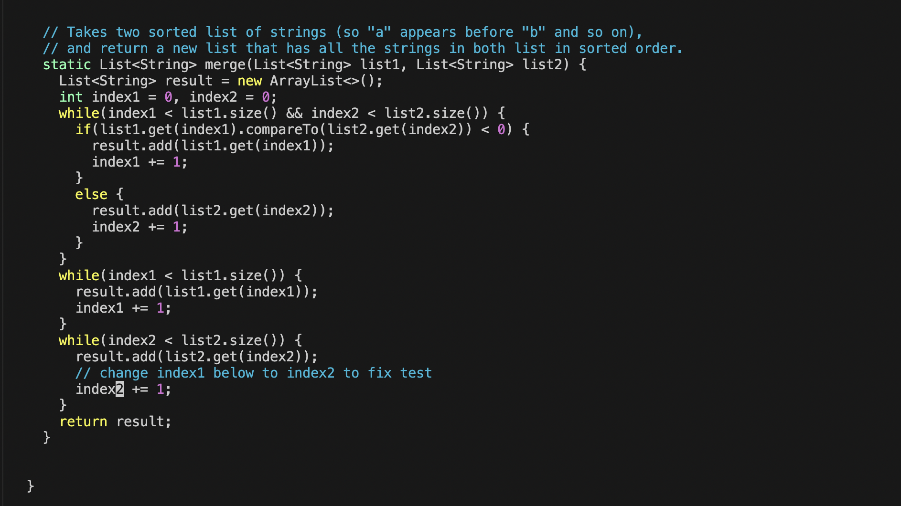

# Lab Report 4
**Step 4**
 
Key pressed: `ssh yiw128@ieng6-201.ucsd.edu` then I press `enter`  
Use `ssh` to log into `ieng6` server. This command line is used to log into ieng6 by using my own school account so that the terminal can run on school's computer. 

**Step 5**
 
Key pressed: "git clone git@github.com:yjiaWu/lab7.git" then I press `enter` 
Use `git clone` command to clone the the repository into `ieng6`. Since we should use the forked repository from Github, we use the password-protected `ssh key`, which is `git@github.com:yjiaWu/lab7.git`. This command line helps me to successfully clone the lab7 into the computer. 

**Step 6**
 
Key pressed: `cd lab7` 
This command line is used to change directory into lab7, so I can use terminal to make changes for lab7. 
Key pressed: `ls` 
This command line is used to list out all the files in `lab7` directory. I want to see what's the file's name for `bash` to run the test. 
Key pressed: `bash test.sh`
Use `bash` command to run the `test.sh` file. This command aims to run the tests in the directory to check the test results, so I can know if the java file has bugs. 

**Step 7**
 
 
