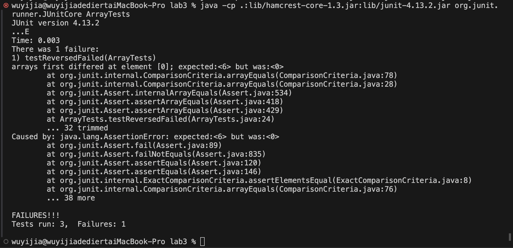
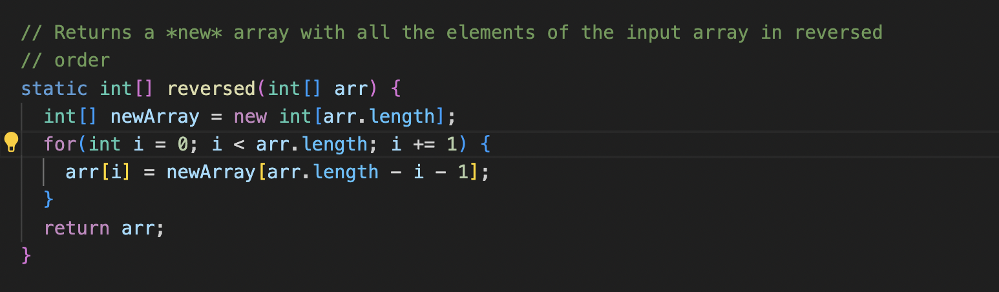
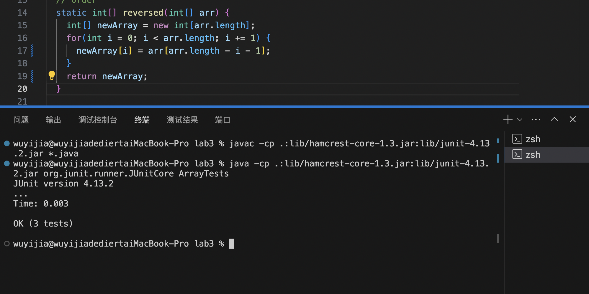
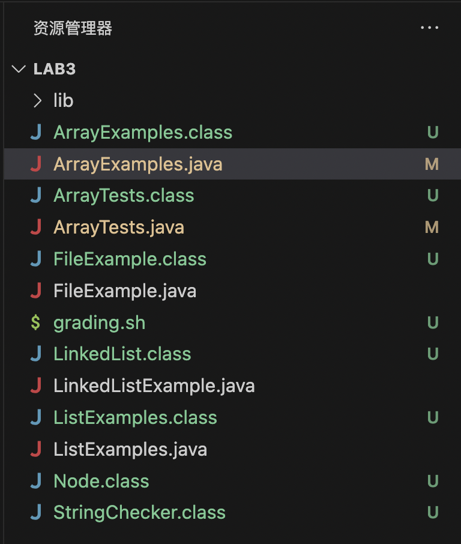
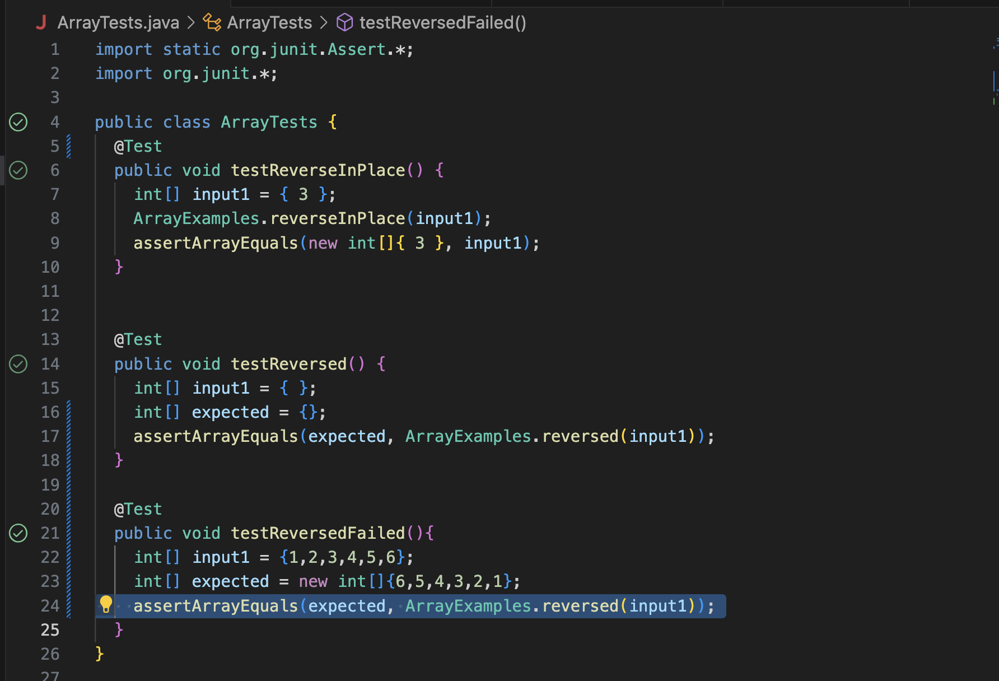
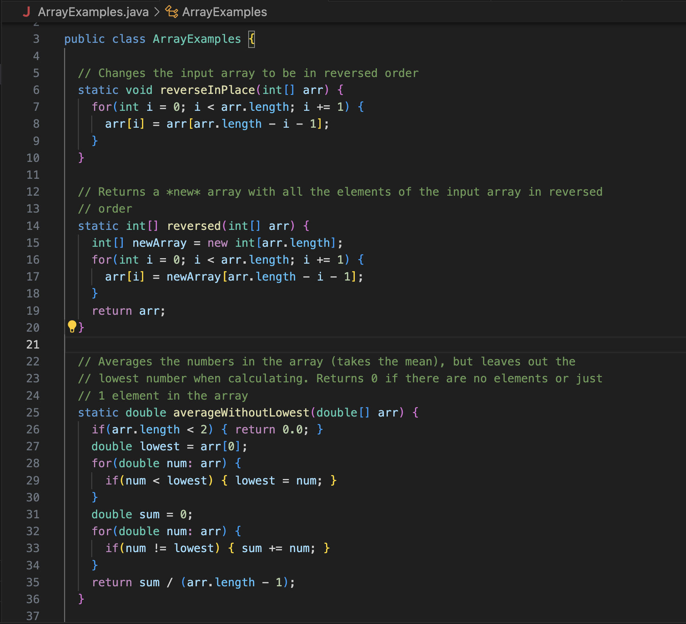
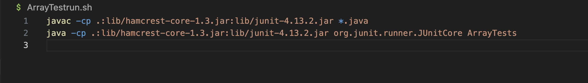

# Lab Report 5

## Part 1 
The student post:  
I am testing the reserve method in the ArrayExamples.java, and run the ArrayTests.java. The the output said that one test failed for the reverse function. I believe it's the for loop for reverse method is wrong, so it didn't correctly reserve the array list into the new list. Below are my screenshots of the output and the code of the method.  
 
 

**TA response**
Yijia Wu: Try to replace the `arr` and `newArray`'s position in the for loop. Right now, you are copying the content in the `newArray` into the `arr`. You should do it in an oposite way, and return `newArray` at the end. 

**After the debugging**
The bug is acutally inside the for loop. I switch the position for `arr` and `newArray` to allow the the element in `arr` is copied into `newArray` in a reverse order through the for loop. Also, I change the returned varaible from `arr` into `newArray`, so that the output would be the reversed array list. I believe by doing this change, the for loop would copy the element in `arr` from the last element into the `newArray` from index 0 in an reverse order. 
 

**Setup**
The file and direcotry needed are in the lab3. 
 
The content of each file before fixing the bug: 
ArrayTests.java: 
 
ArrayExamples.java: 
 

ArrayTestrun.sh: 
 

## Part 2 
One thing very cool I learnt in the lab is `vim`. Trough the `vim` commend, I can successfully edit files in the terminal, and commit the change to the github through terminal as well. Before, I always thought terminal is used to run files, and I didn't know that terminal is powerful enough to edit the file. By knowing how to use a vim, when I access something that is not locally downloaded in computer, I can still have a method to make adjustment to it and view the content of the file. I think this is a very powerful tool. 

